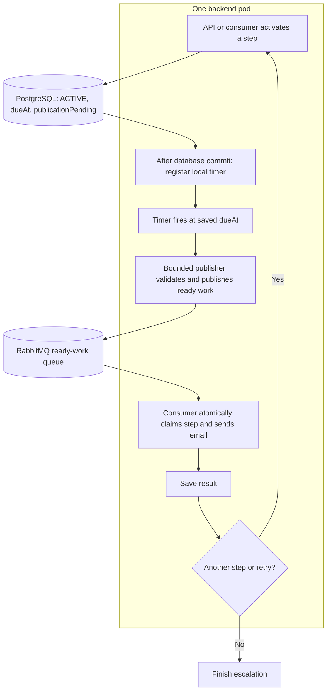

# In-memory timer implementation plan

Created: 2026-09-29. Status: implementation and verification complete for the single-pod launch flow.

## Objective

Launch with **one backend pod** running the product APIs, in-memory timers, RabbitMQ publication, and email consumption in the same Spring Boot process. PostgreSQL and RabbitMQ remain infrastructure dependencies; they do not require separate scheduler and worker application pods.

Use application timers to wait until a response step is due, then use RabbitMQ to hold and distribute ready work. PostgreSQL preserves schedules and execution state across restarts. Waiting messages move out of the shared TTL queue, which currently allows unrelated escalations to delay each other.

Scale only when measured usage requires it. Separate application roles, a scheduling-request queue, leader election, and timer partitioning are later stages. An idle launch does not need that infrastructure.

This plan builds on the current uncommitted scheduling changes. It does not require a separate outbox table or recurring database scans for due steps while the system is healthy. Queries run when schedules arrive, timers fire, startup recovery runs, or known failures are retried.

## Initial flow: one backend pod

The next step is activated only after the current attempt finishes. Each email retry gets its own attempt number and due time. The timer and ready-work message describe one attempt of one step; they do not contain the complete workflow or email content.

RabbitMQ is useful even with one backend pod: it holds confirmed ready work through application restarts and supports later consumer scaling. Future waits remain in PostgreSQL and the local timer registry.

## Decisions for launch

| Concern | Decision |
| --- | --- |
| Application runtime | One combined backend process; one timer owner |
| Durable schedule | Existing `flow_execution_state` row and saved UTC `dueAt` |
| Scheduling handoff | Local registration after the database transaction commits |
| Timer implementation | Spring `ThreadPoolTaskScheduler` / Java scheduled executor |
| Timer identity | Step ID, send-attempt number, and saved due time |
| Timer contents | Small immutable descriptor; no managed JPA entity or task description |
| Queue topology | Dedicated durable `alertops.escalation-step-ready.exchange` / `alertops.escalation-step-ready.queue`; explicit failed-message handling |
| Publication safety | Persistent messages, correlated confirms, and unroutable-message returns |
| Recovery | Bounded startup and failure recovery; keep original due times |
| Timer capacity | Configurable limit with rejection and recovery behaviour |
| Clock behaviour | Recheck saved due time before publication and delivery |
| Additional application pods | Add only after measured workload or availability needs justify them |
| Tests | Focused timer, PostgreSQL, RabbitMQ, and regression tests run; see verification results below |

The application is not live yet. This plan covers the new implementation; moving existing production data or queued work is outside its scope. Multiple backend processes require the ownership and scheduling handoff described in the later scaling stages.

## Durable scheduling state

Reuse the existing fields:

| Field | Meaning |
| --- | --- |
| `dueAt` | Earliest eligible execution time for this attempt |
| `publicationPending` | Ready work still needs confirmed publication after its timer fires |
| `sendAttemptCount` | Attempt identity used to reject obsolete messages and callbacks |

1. Save `ACTIVE`, `dueAt`, and `publicationPending=true` in the same database transaction.
2. After commit, register the timer locally. Registering a timer leaves `publicationPending=true`.
3. At the due time, validate saved state and publish ready work to RabbitMQ.
4. Confirmed acceptance clears `publicationPending`, conditional on the matching attempt and due time.
5. The consumer atomically claims the attempt and clears obsolete pending state.

If the process stops after commit but before registration, startup recovery reconstructs the timer from PostgreSQL. If local registration fails while the process stays alive, a tracked retry must repair it. No scheduling-request queue or additional request flag is needed for this single-process handoff.

Late confirmations must never clear the flag of a newer attempt. Broker acceptance is not email delivery, and `SENT` continues to mean SMTP acceptance.

## Implementation tasks, in reviewable order

### 1. Define timer and ready-work contracts

- [x] Keep one combined application runtime for launch. Separate scheduling and delivery in code so they can run independently later.
- [x] Define immutable timer descriptors and ready-work contracts with step ID, attempt, and due time.
- [x] Add conditional repository updates matching attempt identity and due time, bounded recovery queries, and appropriate indexes.
- [x] Use the existing `dueAt` and `publicationPending` fields for durable schedule state.
- [x] Make timer limits, thread counts, retry timing, consumer concurrency, and prefetch configurable. Initial defaults are not capacity guarantees.

**Done when:** one process can use durable schedule state and compact delivery contracts without a new cross-process scheduling protocol. **Complete and verified.**

**Files:** `FlowExecutionState`, `FlowExecutionStateRepository`, `EscalationStepSchedule`, `EscalationStepReadyMessage`, timer configuration, and application properties.

### 2. Register timers after commit

- [x] Change the after-commit scheduling listener to register a local timer rather than publish to the TTL delay queue.
- [x] Keep rollback behaviour: an uncommitted schedule never registers a timer.
- [x] Validate current saved state before registration and track failed registrations for bounded retries.
- [x] Stop failure-recovery queries once failed registrations are repaired; do not add an idle database polling loop.
- [x] Keep the durable pending flag until ready-work publication is confirmed.

**Done when:** both API requests and consumer next-step transitions register timers in the same process, and failed registration remains recoverable. **Complete and verified.**

**Files:** `StepSchedulingService`, `ReconcilerService`, and the timer registry.

### 3. Implement the timer registry

- [x] Register one current entry per step, identified by attempt and due time.
- [x] Deduplicate registration, ignore obsolete state, and cancel superseded entries without letting an old callback remove a newer entry.
- [x] Schedule future work for its remaining delay; dispatch overdue work promptly.
- [x] Keep callbacks short: submit to a bounded publication executor. Do not send email or wait for broker confirms on timer threads.
- [x] Handle executor saturation by preserving the durable pending state and scheduling a retry wake-up.
- [x] Keep an entry tracked while its publication is in flight to prevent parallel local callbacks for the same step.
- [x] Remove completed and cancelled entries and enable removal of cancelled tasks from the executor queue.
- [x] Enforce a configurable timer-count limit. Schedules that cannot enter memory remain durable in PostgreSQL and are registered as a slot frees; they can run late while capacity is full. Do not keep an unbounded retry list in memory.
- [x] Add graceful shutdown: stop new registrations, cancel future callbacks, bound in-flight publication draining, and leave unfinished work recoverable.

**Done when:** independent long and short waits run according to their own due times, registry size is bounded, and completed work releases memory. **Complete and verified.**

**New components:** timer registry, scheduler configuration, and bounded ready-work publication executor.

### 4. Publish ready work and retain consumer safety

- [x] Before publishing, reload the current step and escalation. Require the matching attempt, `ACTIVE`, `NOT_SENT`, `publicationPending=true`, and a running escalation.
- [x] Recheck `dueAt`. If the callback is early, register the remaining wait instead of publishing early.
- [x] Publish directly to the ready exchange/queue without TTL or delayed routing.
- [x] Use persistent delivery, correlated confirms, mandatory routing, and bounded confirmation timeouts.
- [x] Clear `publicationPending` only after broker acceptance, conditional on the same attempt and due time.
- [x] On failure, schedule a bounded retry wake-up without changing the business due time or consuming an SMTP retry attempt.
- [x] Keep the consumer's atomic delivery claim, state validation, next-step selection, and SMTP retry policy.
- [x] Add a due-time guard to ready delivery. An early message restores pending state and registers its timer after commit without claiming or sending the step.
- [x] Make successful advancement, terminal SMTP failure, and SMTP retries use the same scheduling service.
- [x] Retry listener exceptions with bounded backoff; send messages that still fail to the durable error queue instead of looping forever.

**Done when:** duplicate publication or queue delivery cannot normally advance a step twice, and no eligible step is lost on publication failure. **Complete and verified.**

**Files:** `MessagePublisher`, `MessageConsumer`, repository, and scheduling services.

### 5. Implement restart and failure recovery

- [x] On application startup, load `ACTIVE` / `NOT_SENT` steps for running escalations with `publicationPending=true`.
- [x] Use keyset/cursor pagination so recovery progresses beyond the same first 100 future schedules.
- [x] Merge startup recovery and live registration safely through registry deduplication.
- [x] Revalidate saved state before dispatch so stopped, completed, or superseded runs are skipped. Future acknowledgement semantics must use this guard; acknowledgement is not implemented here.
- [x] Retry local registration, database, and broker failures without holding database locks while waiting or contacting RabbitMQ.
- [x] Expose active timer count, pending schedule count, and recovery completion through the authenticated `/actuator/scheduling` endpoint.

**Done when:** restarting the combined application resumes eligible work with its original due time, including more than one recovery batch. **Complete and verified with database-backed recovery tests.**

**Availability boundary:** no application timer fires while the single backend pod is down. When it restarts, overdue unpublished work is dispatched promptly; confirmed ready work remains in RabbitMQ. PostgreSQL and broker outages can also delay processing. Automatic application failover is a later scaling stage.
### 6. Verify the single-pod flow

Verification uses the regular Maven suite plus opt-in PostgreSQL and RabbitMQ integration suites. Set `POSTGRES_INTEGRATION_TEST=true` with `POSTGRES_INTEGRATION_URL`, `POSTGRES_INTEGRATION_USERNAME`, and `POSTGRES_INTEGRATION_PASSWORD`; set `RABBITMQ_INTEGRATION_TEST=true` with `RABBITMQ_INTEGRATION_HOST`, `RABBITMQ_INTEGRATION_PORT`, `RABBITMQ_INTEGRATION_USERNAME`, and `RABBITMQ_INTEGRATION_PASSWORD` to run the external-service checks. The latest combined run executed 81 tests: 80 passed and the unrelated Redis integration test was skipped. The database suite used a temporary PostgreSQL schema and removed it after the run. The RabbitMQ suite used temporary queues and an exchange and removed them after each test.

- [x] Timer tests use an injectable clock and controllable scheduler, avoiding long sleeps.
- [x] Tests cover deduplication, concurrent registration, attempt replacement, cancellation cleanup, overdue dispatch, early callbacks, and capacity/executor saturation.
- [x] PostgreSQL tests cover rollback, after-commit registration, pending-flag transitions, and late confirmations.
- [x] Recovery tests load more than 100 future schedules and verify atomic concurrent claims.
- [x] Real RabbitMQ tests verify persistent ready messages, confirms and returns, redelivery after a consumer nack, and the ready-work message contract.
- [x] Two independent escalations schedule a long wait first and a short wait second; the short wait dispatches first.
- [x] PostgreSQL-backed tests simulate recovery after commit but before registration, and after registration but before expiry, while preserving the saved due time.
- [x] Tests cover broker acceptance before flag-update failure and duplicate consumer claims.
- [x] Tests cover graceful shutdown with both future timers and an in-flight publication.
- [x] This document records that SMTP acceptance before the database records `SENT` can duplicate an email; exactly-once SMTP submission is not guaranteed.

**Done:** the listed timer, PostgreSQL, RabbitMQ, and regression checks passed. Restart cases were simulated by rebuilding the timer registry from committed database rows; no whole-process kill test was run. The Redis integration test was skipped because it is outside this scheduling change.

## Failure scenarios to cover at launch

| Failure | Durable state / expected recovery |
| --- | --- |
| Schedule transaction rolls back | No committed schedule and no timer |
| Application stops after commit, before registration | Pending row rebuilds timer on startup |
| Local registration fails without a crash | Tracked retry restores registration; pending row remains saved |
| Application stops with future timers | Rebuild pending timers on startup using original due times |
| Broker or database fails when a timer fires | Retain pending state and retry using original `dueAt` |
| Ready work accepted, confirmation recording fails | Possible duplicate publication; atomic claim protects normal execution |
| Old callback or confirmation arrives | Match saved attempt and due time; skip obsolete work |
| Early callback or ready message | Recheck due time and arrange remaining wait without claiming the step |
| Run stops before dispatch | Current-state validation skips work and cleans up timer |
| Application stops before consumer transaction commits | Database work rolls back; unacknowledged ready work can be redelivered |
| SMTP accepts mail before application records `SENT` | Email may be submitted again; external side-effect limitation remains |
| Timer or publication executor reaches capacity | Excess schedules remain pending in PostgreSQL; a freed timer slot triggers recovery. Dispatch can be late |

## Grow only when usage requires it

| Stage | Trigger | Architecture and required changes |
| --- | --- | --- |
| 1. Launch | Initial users; measured workload fits one backend | One combined backend pod using the flow above |
| 2. Separate workers | Sustained ready-work backlog or API latency caused by delivery load after tuning concurrency within provider limits | One scheduler pod plus API/consumer pods; implement durable scheduling handoff before adding replicas |
| 3. Scheduler failover | Availability requirements justify recovery without waiting for the sole scheduler replacement | Active/standby scheduler ownership, takeover recovery, and stale-owner safeguards |
| 4. Partition timers | Timer registration, recovery time, or dispatch delay becomes a measured scheduler bottleneck | Explicit schedule assignment across owners and safe takeover |

There is no fixed user count that requires another pod: active schedules, email volume, traffic, provider limits, and measured resource use determine the need. Scaling consumers does not increase email-provider quotas.

### Required before stage 2

- [ ] Add `combined`, `scheduler`, and `worker` runtime roles and listener configuration.
- [ ] Add a durable RabbitMQ scheduling-request queue carrying step ID, attempt, and due time. API/consumer pods publish requests after commit; the scheduler validates and registers timers before acknowledging them.
- [ ] Add `schedulingRequestPending` to distinguish confirmed scheduling-request publication from confirmed ready-work publication. Keep `publicationPending=true` through timer registration so scheduler restart can rebuild acknowledged requests.
- [ ] Use confirmed persistent request publication, deduplication, and conditional flag updates for the same attempt and due time.
- [ ] Recover requests after producer restart or known publication failure. Define recovery when a producer disappears without replacement: a saved flag alone does not immediately notify a still-running scheduler. Any event-driven repair must handle missed events and reconnection; otherwise document the recovery boundary and operational action.
- [ ] Test requests generated on a worker, scheduler restart after request acknowledgement, producer crash before request publication, and one scheduler with multiple workers.

### Later availability and capacity work

- [ ] Add ownership such as a Kubernetes Lease for active/standby schedulers. Stop stale owners and rebuild timers when leadership changes. Multiple candidates must not independently register and run timers as active owners.
- [ ] Add schedule partitioning only after measurements show a single scheduler is the bottleneck.
- [ ] Optionally benchmark 18,000 compact timers, expiry bursts, cancellation, and recovery. This is a future growth scenario, not a launch requirement or a measured memory guarantee.

## Suggested review checkpoints

1. Review local after-commit registration and durable pending state.
2. Review timer lifecycle, ready-work publication, and consumer guards.
3. Review restart recovery, limits, and failure boundaries.
4. Review complete-flow verification and integration evidence.

Keep changes reviewable at these checkpoints. Commit only when explicitly requested.

## References

- [Current critical release checklist](product-launch-readiness.md)
- [Java 17 scheduled executor: fixed thread pool, timing and cancellation behaviour](https://docs.oracle.com/en/java/javase/17/docs/api/java.base/java/util/concurrent/ScheduledThreadPoolExecutor.html)
- [Spring scheduling abstractions](https://docs.spring.io/spring-framework/reference/integration/scheduling.html)
- [RabbitMQ publisher confirms and consumer acknowledgements](https://www.rabbitmq.com/docs/confirms)
